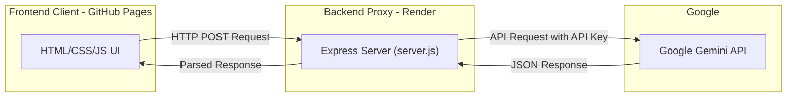

# ⬡ MentorVerse AI

**MentorVerse AI** is a personalized, interactive AI career mentor built for the browser. Powered by the Google Gemini API (`gemini-2.5-flash`), it acts as a dedicated career counselor to help students and developers navigate their tech careers, identify skill gaps, and build actionable study roadmaps.

🚀 **Live Demo:** [MentorVerse AI on GitHub Pages](https://haripriya-droid.github.io/Mentorverse-ai/)

---

## ✨ Features

- **Powered by Google Gemini:** Leverages the Gemini API for highly contextual, intelligent career advice.
- **Secure Backend Proxy:** API keys are hidden on a Render backend so users don't need to provide their own keys to use the app.
- **4 Distinct Mentor Personalities:** Choose between *Professional*, *Motivational*, *Gen Z*, or *Roast* to match your preferred learning and feedback style.
- **Comprehensive Modules:**
  - **Profile Setup:** Personalize the AI's context with your goals, skills, and background.
  - **Career & Skill Gap:** Analyze your current skills versus industry requirements.
  - **Roadmap & Study Plan:** Generate week-by-week actionable learning paths.
  - **Projects Space:** Get customized project ideas that build your portfolio.
  - **Internship & Report:** Evaluate your readiness for internships and download a compiled Markdown report of your progress.
- **Interactive Chat:** Ask specific follow-up questions in a continuous chat interface.
- **Local Storage Persistence:** Your profile and generated guidance are securely saved in your browser so you never lose your progress.
- **Lightweight & Fast:** Frontend built entirely with vanilla HTML, CSS, and JavaScript. Backend proxy built with Node.js and Express.

---

## 🏗️ Architecture

To keep the application secure and user-friendly, the project is split into two parts:
1. **Frontend (GitHub Pages):** Contains all the UI, logic, and state management (HTML/CSS/JS).
2. **Backend Proxy (Render):** A lightweight Express server (`server.js`) that safely holds the Gemini API key and forwards requests from the frontend to the Google Gemini API.

### 📊 Architecture Chart



### 📂 Project Structure

```text
capstone/
├── app.css              # Styles for the main application pages
├── app.html             # Main application layout and interface
├── app.js               # Frontend logic and API interactions
├── index.html           # Landing/Home page
├── package.json         # Node.js dependencies and scripts
├── README.md            # Project documentation
├── script.js            # Frontend logic for the landing/home page
├── server.js            # Express backend proxy server
└── style.css            # Styles for the landing/home page
```

---

## 🛠️ Technologies Used

- **Frontend:** HTML5, CSS3, Vanilla JavaScript
- **Backend:** Node.js, Express, CORS
- **AI Integration:** Google Gemini API (`gemini-2.5-flash`)
- **Deployment:** GitHub Pages (Frontend), Render (Backend)

---

## 💻 Getting Started Locally

If you want to run this project on your own machine:

1. **Clone the repository:**
   ```bash
   git clone https://github.com/haripriya-droid/Mentorverse-ai.git
   cd Mentorverse-ai
   ```

2. **Install backend dependencies:**
   ```bash
   npm install
   ```

3. **Set up your API Key:**
   - Create a file named `.env` in the root folder (or set it in your system environment variables).
   - Add your Gemini API key:
     ```env
     GEMINI_API_KEY=your_api_key_here
     ```

4. **Start the backend server:**
   ```bash
   npm run dev
   # or
   node server.js
   ```

5. **Run the frontend:**
   - Open `index.html` in your browser. (Alternatively, use an extension like Live Server in VS Code).
   - *Note: If running locally, you may need to temporarily change `BACKEND_URL` in `app.js` to `http://localhost:3000`.*

---

## 🚀 Deployment

### Frontend (GitHub Pages)
1. Go to repository **Settings** > **Pages**.
2. Select **Deploy from a branch**.
3. Choose the `main` branch and `/ (root)` folder.
4. Click **Save**.

### Backend (Render)
1. Create a new **Web Service** on [Render](https://render.com).
2. Connect this repository.
3. Use the following settings:
   - **Environment:** `Node`
   - **Build Command:** `npm install`
   - **Start Command:** `node server.js`
4. Add an **Environment Variable**:
   - Key: `GEMINI_API_KEY`
   - Value: `your_google_gemini_api_key`
5. Click **Deploy**.

---
*Built by student, built for students*
